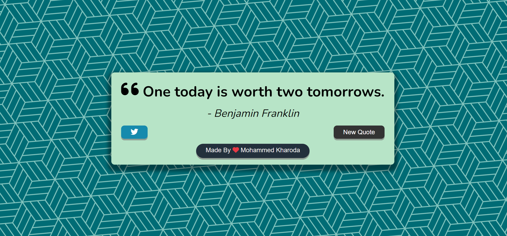

 <h1 style="text-align:center">
 Quote Generator
     
    </h1>

Quote Generator Is the JavaScript tool that is being used for generating the different Quotes you can also tweet the Quote from the browser Itself 😊

## Documentation 📃

1. [API Used](https://type.fit/api/quotes)
2. [HTML](https://developer.mozilla.org/en-US/docs/Web/HTML)
3. [CSS](https://developer.mozilla.org/en-US/docs/Web/CSS)
4. [JavaScript](https://developer.mozilla.org/en-US/docs/Web/JavaScript)

## Learn More About the API

1.  [API Fetching 🤙🏼](https://developer.mozilla.org/en-US/docs/Web/JavaScript/Reference/Statements/async_function)

## Demo

[Live Demo 💻](https://quote-generator-mohammed-kharoda.netlify.app/)

## Screenshots 🖼️

## Features 😁

- Direct Tweet to the Twitter
- Live previews
- Multiples Quotes to choose from
- Cross platform
